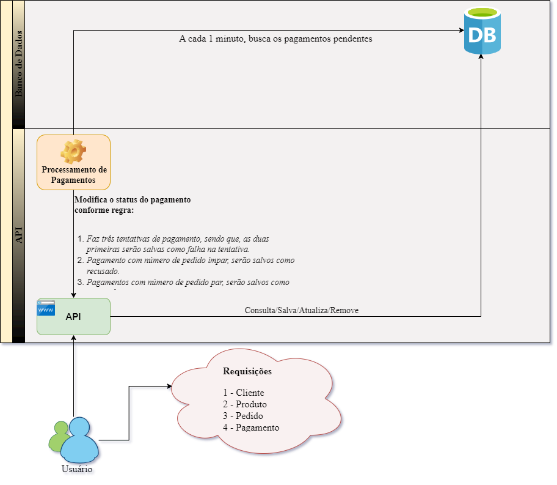

<h1 align="center">Tech Challenge Fase 2 - Turma 4SOAT - Grupo 68</h1>

<span style="font-family:Times New Roman; font-size:13px;">

<div align="justify">
Há uma lanchonete de bairro que está expandindo devido seu grande sucesso. Porém, com a expansão e sem um sistema de controle de pedidos, o atendimento aos clientes pode ser caótico e confuso. Por exemplo, imagine que um cliente faça um pedido complexo, como um hambúrguer personalizado com ingredientes específicos, acompanhado de batatas fritas e uma bebida. O atendente pode anotar o pedido em um papel e entregá-lo à cozinha, mas não há garantia de que o pedido será preparado corretamente.<br/>
Sem um sistema de controle de pedidos, pode haver confusão entre os atendentes e a cozinha, resultando em atrasos na preparação e entrega dos pedidos. Os pedidos podem ser perdidos, mal interpretados ou esquecidos, levando à insatisfação dos clientes e a perda de negócios.<br/>
Em resumo, um sistema de controle de pedidos é essencial para garantir que a lanchonete possa atender os clientes de maneira eficiente, gerenciando seus pedidos e estoques de forma adequada. Sem ele, expandir a lanchonete pode acabar não dando certo, resultando em clientes insatisfeitos e impactando os negócios de forma negativa.<br/>
Para solucionar o problema, a lanchonete irá investir em um sistema de autoatendimento de fast food, que é composto por uma série de dispositivos e interfaces que permitem aos clientes selecionar e fazer pedidos sem precisar interagir com um atendente.<br/><br/>
Este projeto é um dos módulos que compõe esta solução.
</div>

##### 1. Informações do projeto:

1. **Módulo:** Backend.
1. **Arquitetura:** Clean architecture.
1. **Padrões de Codificação:** Clean code.
1. **Linguagem:** Java versão 17.
1. **Banco de Dados:** PostgreSQL. 
1. **Container:** Docker.
1. **Orquestrador:** Kubernet.


##### 2. Desenhos Arquiteturais.

###### 2.1. Requisitos de Infraestrutura.

###### 2.1.1. Arquitetura de Infraestrutura.

Para esse módulo, ficou definido que seria usuado o Docker (Container) com o Kubernetes (Orquestração), pois toda aplicação e componentes de infraestrutura  estaria rodando em ambiente/maquina local. <br/>
Para isso, utilizou-se o modelo que se segue na imagem abaixo:


###### 2.2. Requisitos de negócio (problema).

###### 2.2.1. Clean Architecture - Arquitetura Limpa.
Conforme informado anteriormente<sub>[1]</sub>, o padrão arquitetural definido para esse projeto foi a Clean Architecture. Esse conceito proposto por Robert Martin – mais conhecido como Uncle Bob – tem como objetivo promover a implementação de sistemas que favorecem reusabilidade de código, coesão, independência de tecnologia e testabilidade.

Para esse módulo, aplicamos esse conceito da seguinte forma:


###### 2.2.2. Arquitetura MVP.



*Lembrete:* Para esse módulo, se faz necessário esse desenho para ilustrar a solução de negócio apresentada.

**Dado as seguintes regras:** 

a. 	Alterar/criar as APIs: 
             
&nbsp;&nbsp;i.	Checkout Pedido que deverá receber os produtos solicitados e retornar a identificação do pedido.<br/>
&nbsp;&nbsp;ii.	Consultar status pagamento pedido, que informa se o pagamento foi aprovado ou não.<br/>
&nbsp;&nbsp;iii. Webhook para receber confirmação de pagamento aprovado ou recusado.<br/>
&nbsp;&nbsp;iv. A lista de pedidos deverá retorná-los com suas descrições, ordenados com a seguinte regra: <br/>
&nbsp;&nbsp;&nbsp;&nbsp;1. Pronto > Em Preparação > Recebido;<br/>
&nbsp;&nbsp;&nbsp;&nbsp;2.Pedidos mais antigos primeiro e mais novos depois;<br/>
&nbsp;&nbsp;&nbsp;&nbsp;3.Pedidos com status Finalizado não devem aparecer na lista.<br/>
&nbsp;&nbsp;v.	Atualizar o status do pedido.<br/>
&nbsp;&nbsp;vi.	Como desafio extra, opcionalmente, você pode implementar a integração com Mercado Pago para gerar o QRCode para pagamento e integrar com o WebHook para capturar os pagamentos. Caso contrário, será necessário realizar o mock da parte de pagamentos. Como referência, acesse: <a href="https://www.mercadopago.com.br/developers/pt/docs/qr-code/integration-configuration/qr-dynamic/integration" rel="noopener" target="_blank">site do mercado pago</a>.


**Solução apresentada:**

Na definição da solução para a forma de pagamento (itens iii e vi), chegou-se ao concesso que não iriamos integrar com o `Mercado Pago` ou qualquer outra integradora de pagamento. Ao realizar essa integração, teriamos que ter uma URL exposta publicamente para que nós enviasse a mundaça de status do pagamento no WebHook. 

Como não queriamos implantar esse módulo em uma Cloud, como por exemplo: Azure, AWS e etc, pois gostariamos que toda solução rodasse na maquina local, preferimos partir para um processamente que fosse realizado pelo proprio módulo.

Dados essas definições, a solução apresentada foi de criar um JOB (`Sheduler`), que ficaria rodando de 1 em 1 minutos, simulando o envio de um WebHook do `Mercado Pago`. Teremos assim, um endpoint que receberá as requisições dessa `Sheduler` e segundo essas três regras abaixo, irá processar os pagamentos:

1. Faz três tentativas de pagamento, sendo que, as duas primeiras serão salvas como falha na tentativa. <br/>
 1.1. A três tentativa será salvo como se segue nos itens abaixo.
1. Pagamento com número de pedido ímpar, serão salvos como `Recusado`.
1. Pagamentos com número de pedido par, serão salvos como `Aprovado`.


Esse processo de negar o pagamento, tem o propósito de gerar um histórico de tentativa, pelo qual pode-se consultar todo o processo, dando assim, maior rastreabilidade. 

Também incluímos a regra para negar os pagamentos ímpares e aprovar os pares, justamente para mostrar que o sistema faz os dois processos. Isso porque no futuro pode-se definir uma regra mais abrangente para ambos os casos. 

##### 3. Configuração e Execução: 

1. Clone o [repositório](https://github.com/gleniomontovani/tech-challenge-pos-tech.git) para sua máquina local.
1. Certifique-se de ter o Docker instalado e configurado.
1. Certifique-se de ter o kubectl configurado corretamente para acessar o seu cluster Kubernetes local. <br>
3.1 Caso você esteja no ambiente Windows, lembre-se de habilita-lo no Docker ([veja aqui](https://birthday.play-with-docker.com/kubernetes-docker-desktop/))

##### 4. Construir e Rodar a Aplicação Localmente:

1. Entre na pasta onde você baixou o codigo fonte.<sub>[2]</sub>
2. Após isso, construa a imagem Docker localmente (no mesmo diretório do `Dockerfile`) **:**

```
# docker build -t tech-challenge-pos-tech:latest . 
```

Execulte o seguintes comandos (na seguinte ordem) para implantar os manifestos do Kubernetes:

```
# kubectl apply -f postgres-deployment.yaml
# kubectl apply -f postgres-service.yaml
# kubectl apply -f deployment.yaml
# kubectl apply -f service.yaml
# kubectl apply -f hpa.yaml
```

Caso queira ver os logs da aplicação basta execultar:

```
# kubectl get pods 
```

|NAME         							    |READY |STATUS |RESTARTS    |AGE  |
|-------------------------------------------|------|-------|------------|-----|
|postgresql-64567ff6fd-bmfk8 			    | 1/1  |Running|1 (105m ago)|5d16h|    
|tech-challenge-pos-tech-5785c6dbf4-86g9j   | 1/1  |Running|1 (105m ago)|5d16h|
|tech-challenge-pos-tech-5785c6dbf4-mkbcx	| 1/1  |Running|1 (105m ago)|5d16h|
|tech-challenge-pos-tech-5785c6dbf4-mkct4	| 1/1  |Running|1 (105m ago)|5d16h|

Obtenha o nome do container no campo/coluna `NAME` do resultado do comando acima. Então, execulte o seguinte comando para ver os log da aplicação:

```
# kubectl logs -f nome_do_pod (tech-challenge-pos-tech-5785c6dbf4-86g9j)
```


##### 5. As APIs da aplicação ficaram acessíveis no endereço: 

- **URL:** [http://localhost:32000](http://localhost:32000)


---
##### 6. As APIs disponíveis são: &nbsp;

1. Cliente:   
 1.1. Criação;    
 1.2. Edição;  
1. Produto:   
 2.1. Criação;   
 2.2. Edição;  
 2.3. Remoção;   
 2.4. Busca por número;   
 2.5. Busca por Categoria.
1. Pedidos: <br>
 3.1. Criaação(Com e sem identificação do cliente); <br>
 3.2. Consultar; <br>
 3.3. Alterar Status.
1. Pagamentos:   
 4.1. Consultar por Pedido; <br>
 4.2. Histórico de tentativas de pagamento (Webhook).

&nbsp;

---

>Para utilizar as APIs, baixe o arquivo [JSON](https://github.com/gleniomontovani/tech-challenge-pos-tech/blob/main/Tech-challenge.postman_collection.json) e faça a importação no Postaman.

&nbsp;&nbsp;

</span>